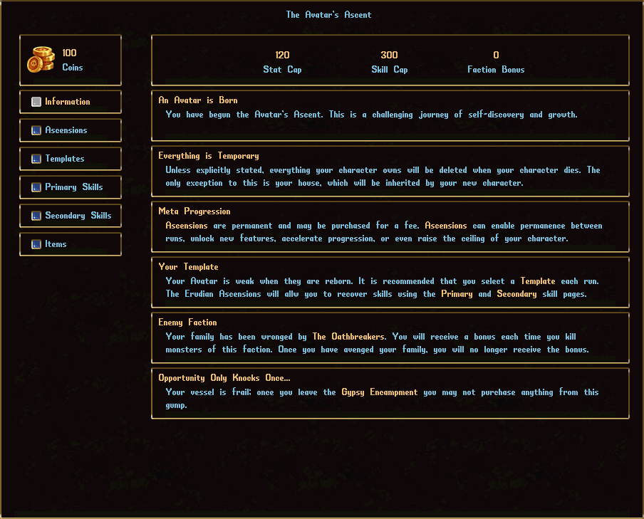

# The Avatar's Ascent

In this roguelite game mode, characters will experience a separate progression track, collect a new currency (“Coins”), and spend aforementioned currency on permanent upgrades.

## The Gameplay Loop

- Kill things
- Earn Coins
- Get killed
- Come back stronger

## Death & Permadeath Flavor

- When you die, your character is deleted and recreated
- Your bank, skills, stats, and items are all gone
- You keep your Coins, safety deposit box, House, Shoppes, and Ascensions from the Avatar Shop

## Gameplay constantly varies

- Pick one of 5 randomly provided starter templates
- Make a build based on your skill availability from your **Skill Archive**
- Hunt down your **Rival Faction** for increased Coins

## Skill & Stat Caps

- **Skill cap** = 300 (*+10 per upgrade*)
	- Gone are the days where your only choice is "Do I level this skill to 100 or 120?"
- **Stat cap** = 100 (*+1 per upgrade*)
	- The *strong* will have more health, better carrying capacity, and can equip better armor
	- The *dexterous* will attack faster in combat, resulting in more skill gains, and bandage faster
	- The *intelligent* can use more spells and abilities

## Permanent Progression

- Your skill gains are permanently tracked in your **Skill Archive**
	- All gains past 30 skill are permanently tracked
	- Your Primary and Secondary skills are separate archives
	- Only half (randomly chosen) of your archive is available per lifetime

## Ascensions
- The following is example list of *Ascensions that you may purchase*
	- Stat cap
	- Skill cap
	- Skill gain rate
	- Coin gain rate
	- Improved Starter templates
	- Primary and Secondary Skill Archive
	- Temptations system
	- Savage Race, Monster Races, and Fugitive Mode
	- Permanent Facet Discovery
	- Permanent Recipe Retention