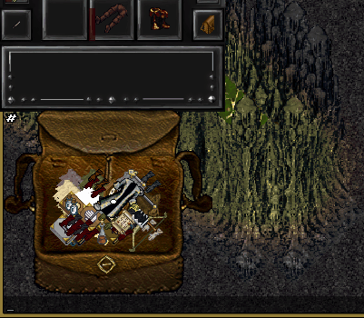
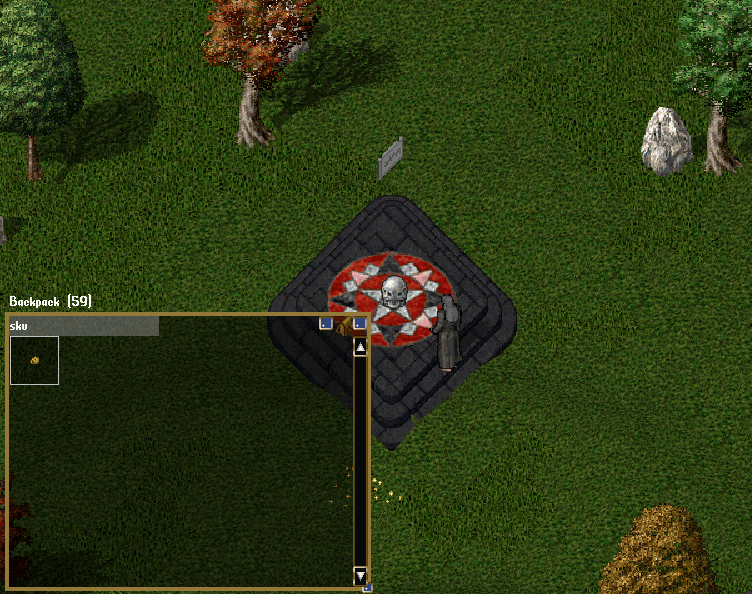
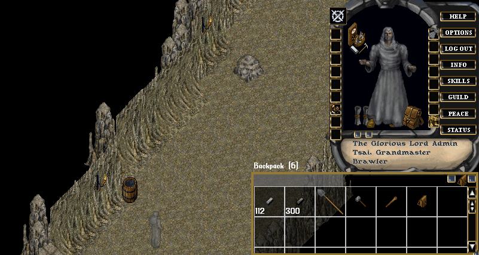
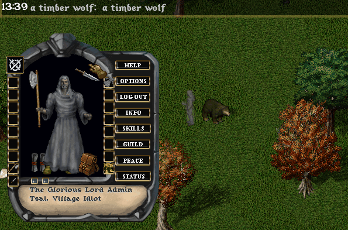
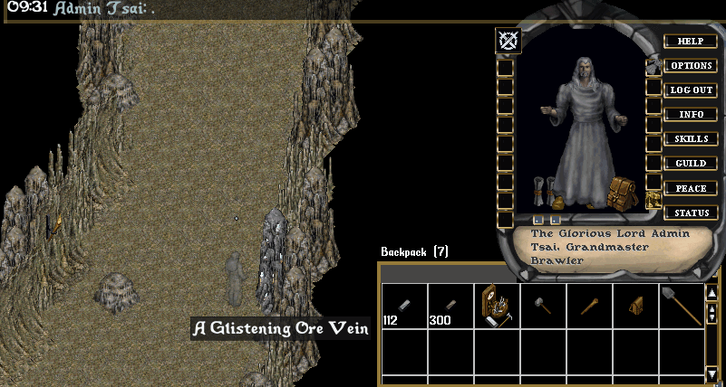
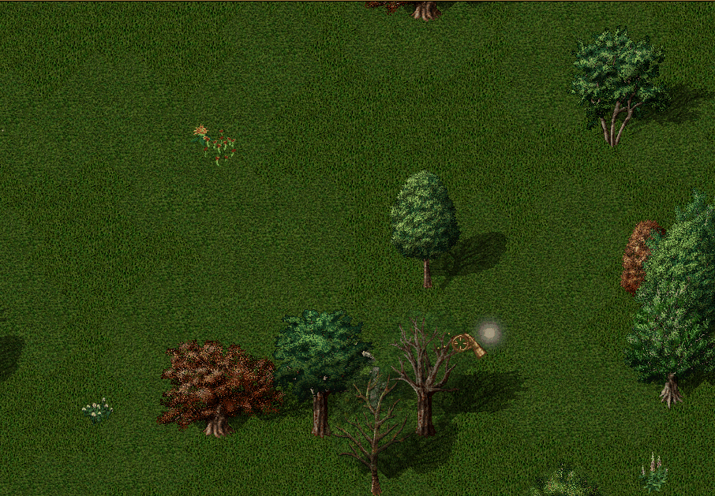

## Commands
### `OrderBy-XX`
- `[OrderBy-XX` will rearrange items of the targeted into a gridlike pattern
	- `[OrderBy-Graphic` - Orders the items by their Graphic
	- `[OrderBy-Hue` - Orders the items by their Hue
	- `[OrderBy-Name` - Orders the items by their Name
	- `[OrderBy-Size` - Orders the items by their Size
	- `[OrderBy-Slayer` - Orders weapons by their Slayer
	- `[OrderBy-Weight` - Orders the items by their Weight

!!! tip "Optional Arguments"
	`[OrderBy-Name 15 30` will specify *15 pixels* between columns and *30 pixels* between rows

### `Organize`
- `[Organize` will grab all items in the target bag and sort them into separate bags
	- Descriptions for the possible bags
		- *Armor* - Armor and Quivers
		- *Casting* - Reagents, Spellbooks, Rune stones
		- *Clothing*
		- *Consumables* - Potions, Scrolls
		- *Crafting* -  Resources, Crafting tools
		- *Currency*
		- *Decorative* - Worth ## Gold, Addons
		- *Jewelry* - Jewelry, Gems
		- *Trinkets & Offhands* - Trinkets, Instruments, Torches, Lanterns
		- *Unidentified Items*
		- *Weapons*

??? tip "Demonstration"
	

### `Rename`
- `[Rename` allows players to rename any container that they own

## Gameplay loop

### Dungeoneers
#### Champion Spawns
- Configurable difficulty champion spawns allow a sense of progression and challenge
	- Rewards increase as you increase `Spawn Amount` and `Monster Difficulty`
- All kinds of players can enjoy this content (Casual players, group play, or challenging solo play)
- AOE focused templates should focus on increasing `Spawn Amount` (impacts amount of mobs & required kills per level)
- Single-target focused templates should focus on increasing `Monster Difficulty` (impacts health/skills/damage)

??? tip "Configuration Demonstration"
	

### Gathering
#### Auto-Harvest
Targeting a node once will automatically retarget it until it is emptied.
??? tip "Demonstration"
	

#### Auto-Separating

#### Auto-Skinning
A skinning knife is the only blade you may use from your backpack.

!!! tip "When equipped, the knife will automatically skin corpses you open."

??? tip "Demonstration"
	

#### Glistening Ore Veins
Rich deposits of ore may be found randomly spawned throughout the world.

!!! tip "The node may be harvested by using a shovel and targeting it or double-clicking it."

??? tip "Demonstration"
	

#### Rich Trees
While lumberjacking trees, players may detect a nearby tree that is rich in wood.

!!! tip "The node may be harvested by using an axe and targeting it or double-clicking it."

??? tip "Demonstration"
	

## Secondary Skills
All *Gathering* and *Crafting* skills can be raised on your character without impacting your skill cap

!!! warning "Due to their treasurehunting functionality, *Cartography* and *Seafaring* are considered Primary Skills"