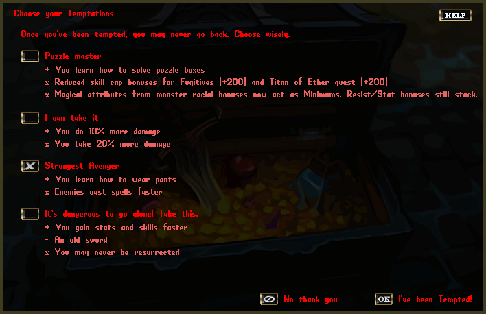

# Temptations

- At it's core, Temptations are a `gameplay modifier` mechanic
- Each character has their own temptations, which can be selected at the Gypsy dialog
- Temptations will generally change gameplay in a notable way
	- `+` is generally considered a positive
	- `x` is generally considered a negative
	- `-` is generally neutral or it is up to interpretation

!!! tip "You may use the `[Temptations` command on yourself or another player to see their Temptations"

## What does each Temptation do?

### Puzzle master
- Replaces the thief pedestals with a Khaldun puzzle lock so that any template can reap the rewards
- Fugitive skill cap bonus is reduced to 200, down from 300
- Titan of Ether skill cap bonus is reduced from 200, down from 500
- Monster racial bonuses work as Minimums; attributes provided by equipment will have no effect until their total sum exceeds that of the monster racial value
	- *Example:* If you have +20% Hit Chance Increase (HCI) racial and your character is naked, equipping +15% HCI will not provide any benefit.

### I can take it
- Multiplicatively increases incoming and outgoing damage

### Strongest Avenger
- Pants are now equipped in the *Inner Leg- equipment slot, instead of the *Outer Leg- slot (where leg armor goes)
- Once caster monsters engage this character, the delay between casting and targeting is dramatically reduced
- *Note:* The original Memento release nerfed caster mobs by forcing them to wait twice the delay after they cast a spell. This reverses that nerf

### It's dangerous to go alone! Take this.
- Enables permanent death mode for the character
- Your stat gain cooldown is 5 mins
- You are ~25% more likely to get a skill gain
- *Note:* This Temptation is brutal. Most players will NOT want to do this. Dying means your character is permanently a ghost (and should probably be deleted). Your house/boat are left in the world, your corpse lasts 24 hours, and your bankbox is completely gone.