## Crime

Crime is a part of life in this world. There are not many crimes the guards care about. They mainly care about murder, theft, or using devastating magic. If you become a criminal, your name will change from blue to gray. You will be a criminal for two minutes. During that time, guards and citizens will chase you down if they see you. Other players can best you in combat and not be reported for murder. Many NPCs will not want to deal with you if you are a criminal.

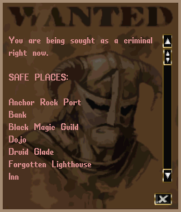

### Murder
Murder is a very horrible crime in the land. You will have committed a murder if you kill an NPC vendor. Attacking player characters in Memento is prohibited. Vendors will report you for murder, where player characters must choose to do so. You can use the INFO button on your paperdoll to see how many murders you have accumulated. You can also select the button on the lower left, to open the wanted poster to see your criminal status. The wanted poster will also give you suggestions on settlements you can visit, whether you are a criminal or not. Murder counts will decrease by one for every forty hours of actual playtime. While you have murder counts, you will always be a criminal.

### Stealing
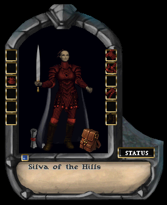

There are various forms of stealing. The first is stealing from vendors or other player characters. To do so, double click their paperdoll to open it. It will be a much more condensed version compared to yours. If you have good snooping skills, you can open their backpack and peek inside. If your hands are free, you can attempt to steal an item that doesn't weigh too much. If you are caught in the act, you will become a criminal.

#### Vendor Coffers
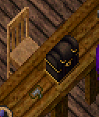

There are also coffers in most shops. You can use these coffers, and if you have good snooping skills, then a stealing test will occur to see if you get anything from it. Don't get caught. If you do, you may want to run because you do not want to accidentally kill someone trying to escape.

#### Dungeon Pedestals
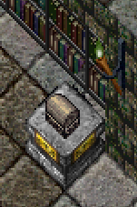

Dungeons may have a pedestal with a box or bag upon it. These will require you to use your stealing skill on them to see if you can take them off the pedestal. The contents may be well worth the danger of the potential traps that could be sprung. You will come across various accessible containers in the dungeon, and these can be stolen in the same fashion.

## Food & Drink

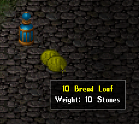
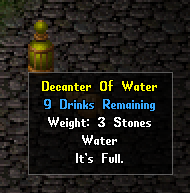

If you do not eat, you will starve. You will begin your journey with a bottle of water and a sack full of food. One of your first quests is to figure out how to stay fed and hydrated. Here is an example of water and bread. I have 10 loaves of bread and a bottle of water. The bottle is full and indicates how many drinks are left in the bottle.

You cannot eat or drink too much. Your belly only holds so much. Ignoring food and drink will eventually take a toll on you. Your hit points, stamina, and mana will slowly decline.

Messages will appear when you start getting hungry or thirsty. Seeing these messages should trigger you to find food and drink or eat and drink what you have with you. Food and drink can be obtained in many ways. It is up to you to figure out how and where.

### Alcohol
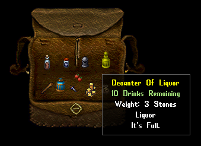

Some drinks contain alcohol (liquor for example). They tend to have a greenish color to the text for the amount of drinks left. Although it will replenish your thirst, you will slowly suffer the effects of drunkenness if you consume too much. Drunkenness will wear off.

### Dangerous Food
Although most food is good for you, some that you find in places like dungeons can be a bit spoiled and unidentified. You can use your tasting skill to determine such things. A number of items are unidentified upon discovery and various skills are used to determine their true information. Vendors in town are willing to help (for a fee) when you are unsure.

## Life & Death

You can heal yourself in various ways. You can use a healing skill with bandages. Potions could help with your healing. There are also magical spells and abilities that can restore health. Health will also restore on its own over time.

### Poison
There are also poisons that can cause you to lose health. They are in forms of strength like lesser, regular, greater, and deadly. There are poison traps, poison potions, or creatures that can poison you. One skilled with poison could poison your food or drink. With that, there are curing potions that can negate these effects or even the Healing skill. There are also some spells or abilities that can remove the effects of poison.

### Hunger
Starving will also reduce your hit points over time. It will not kill you, but it will bring you to the brink of death. Starving will stop you from doing certain abilities, like using bandages. So, make sure to have a loaf of bread and a mug of ale.

### Resurrection
You are going to die. Be it bad luck, falling into a pit, or getting a spear in the back from a lizardman - you will die. When you die, you will wander the world as a ghost. You can interact with nothing, and nothing can interact with you. To return to the land of the living, you will need to find a way to get resurrected. There are many ways to achieve this, but the common ways are healers and shrines.

Resurrection normally requires a tribute to the gods, and this is in the form of gold coins from your bank box. If you want to know what it would cost to resurrect, you can reference the INFO section of your paperdoll. This is the minimum amount of gold you will need to keep in your bank box if you want to resurrect without any physical ailments. If you tithe gold, resurrection costs may be taken from that as well. If you do not have enough gold, then you will need to resurrect with a permanent penalty that will decrease your skills and abilities by a small fraction.

When you are thrust into the afterlife, you will be presented with a window that allows you to resurrect with ailments. If you wish to avoid this, and instead resurrect from a healer or shrine, then close the window and begin your search. Most times, you will be presented with a guided arrow that tries to lead you to the nearest source of resurrection.

#### Resurrection Sources
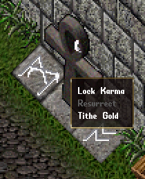

Healers may be wandering the land, but mostly they are in settlements. If you approach one, they will eventually sense your spirit and ask you to be resurrected. If there is a gold tribute required, they will tell you the amount. Once resurrected, your bank box will deplete these funds, or your tithe amount will be reduced by that value.

Shrines come in various forms. They may be an altar, ankh, or statue. You can single click these and select the RESURRECT option in the context menu.

#### Resurrection Costs
The stronger your character gets, the higher your resurrection tribute. So, make sure to check your resurrection costs often, and make sure you can fund your certain doom.

## Mounts

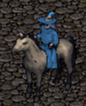
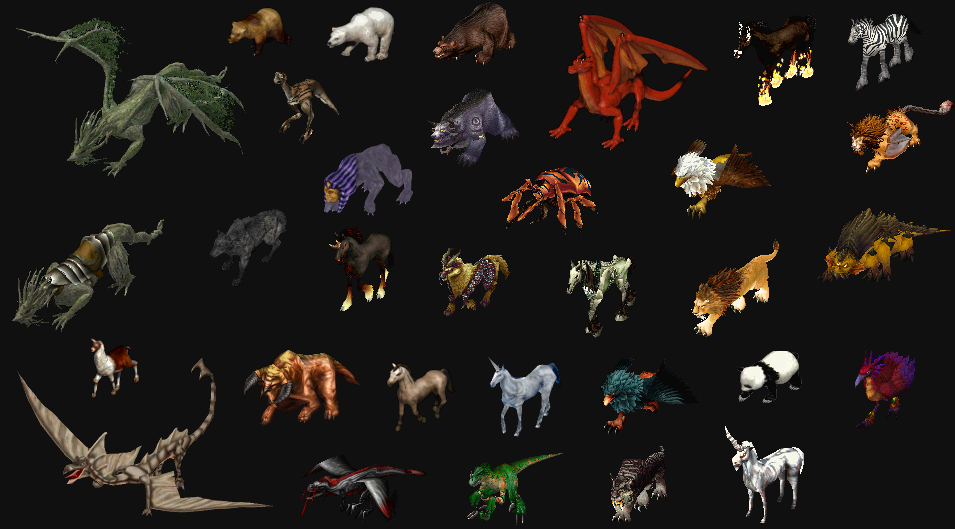

There are certain creatures that you can ride. Although characters can walk or run, riding a mount can help you travel much faster. Mounts are pets under your control, or they are summoned magically to ride. They require a certain amount of control slots. To ride such a creature, stand next to it and double click them. You can double click yourself afterwards to dismount. During battle, some creatures may knock you off your mount. There are also certain areas you may enter, that will have your mount safely wait elsewhere until you leave. Below are some creatures you may see, that can generally be ridden.

## Reputation

How the world views you as a character is your reputation. Reputation consists of both fame and karma. You can view both of these values in the paperdoll's INFO section ([status).

`Fame` is a value between 0 and 15,000. Fame is acquired by slaying various creatures or enemies, or completing quests. `Karma` is a value between -15,000 and 15,000. Karma can be increased by slaying evil creatures. You will lose karma by slaying good creatures. There are other ways to lose karma, such as carving up a human corpse or casting evil magic spells. Your character will have a reputation title, and you can see what that title may be by using the chart in the paperdoll's HELP section under LIBRARY.

Your reputation can affect certain aspects of the world. Good creatures in the land may attack you if you lean more toward evil (-5000 karma or worse). Some spells require a certain reputation to be effective.

### Evil Players
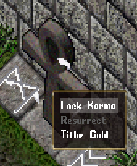

For those seeking a dark and evil life, you can visit any shrine or altar and single click it. Then you can lock your karma from being raised for slaying evil creatures.

## Trading

Trading is something you do with other players. To do so, you would simply drop an item onto that player. A trade window will open. You both can drop items on your side of the trade window. Once you both agree on the items, you can press the box next to your name.

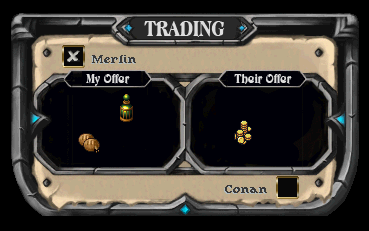

If you check your box, and the other person changes the items on their side, your box will uncheck so you can verify the trade again.

You can hover over the items to verify the amount and type of item being traded.
