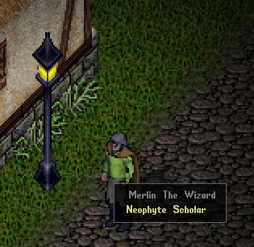
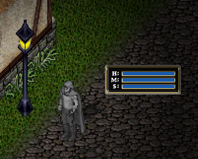
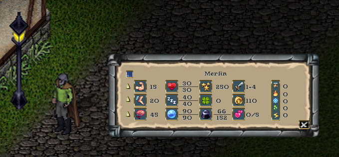
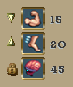

# Character Attributes
There are three primary attributes that have various impacts on your character:

**Strength** governs how much you can carry, how much damage you can do in combat, and which weapons and armor you can equip. This also has a direct correlation with your hit points. Hit points determine how much damage you can take before death. Your strength affects this value. There are various methods of healing that you must discover.

**Dexterity** determines how quickly you react and directly correlates to your stamina. Stamina determines how long you can keep moving or fighting before getting tired. Some potions, or simply resting, will replenish your stamina.

**Intelligence** affects many skills, especially in the categories of crafting and wizardry. This also has a direct correlation with your mana. Mana is your magical aptitude, and it is derived from your intelligence. It also is sometimes used by warriors to perform some feats of battle.

Your abilities can rise when they are directly used by your actions. To manage these ability levels, you can use your cursor and hover over your character. When you click on your character and drag off away from it, you will see a set of status bars that represent your hit points, mana, and stamina. These bars are commonly used during gameplay, as they let you quickly see how healthy your character is. If you double click these bars, it will change to a more informative window that you can see on the next page.

This information window displays your name at the top. There is a blue button on the upper left, that will open your status icons bar (explained later). You will see the values of your abilities and attributes that they affect. You can hover over each piece of information to see what it represents. You can go back to the status bars by selecting the "X" button at the bottom right. You can close the window entirely by right clicking on it.

One important function with this window is the option to set your abilities to cease from increasing. You can gain a maximum of 250 ability points. Notice the up arrows next to each of the abilities. Clicking these arrows will turn the arrow up, down, or locked. Locking an ability will stop it from raising or lowering. Setting the down arrow will lower that attribute when you have already reached the limits of available points and another ability is trying to rise.

This allows you to better tune your character to ensure you get the ability values you desire for your character archetype goals. For example, you want a barbarian with high strength or a wizard with high intelligence.