# Gameplay Basics:
## Hotkeys
There is a bar at the top that provides functions (with equivalent shortcut keys) described below:

**Map** – Pressing `ALT + R` will open a mini-map to help you navigate. Pressing it twice will make it slightly larger.

**Character** – Pressing `ALT + P` will open your paperdoll.

**Inventory** – Pressing `ALT + I` will open your backpack.

**Journal** – Pressing `ALT + J` will open the journal.

**Chat** – This function does not work. Use the chat system in the paperdoll's HELP menu instead.

**Help** – This is the same as the HELP button on the paperdoll.

**World Map** – This will open the more useful customizable navigation map.

You can learn about other commands in the HELP section of the paperdoll. Many of these commands are executed from the bottom bar where you can enter the command and press ENTER. Most of these commands will be prefixed with a "[". So if you wanted to chat, for example, you would type "**[chat**" and press ENTER.

## Movement
To move your character around, you can use the arrow keys on your keyboard. The most common method, however, is to use the mouse. Move the cursor toward the direction you want to move. Then press the right mouse button. Your character will move in that direction, but only if there are no obstacles in the way like walls/trees. If you move the cursor further away from the character, they will run instead of walk. OPTIONS can be set to always run.

Your character can only move at a certain speed. You can, however, find [creatures to ride](art-of-living.md#mounts) and hiking boots. This will increase your speed even faster than base running. If you enable pathfinding, in your client settings, you can double right click on a location and your character will try to walk there on their own.

## Inventory
When you begin your adventure, you will already be dressed in fantasy appropriate garb. The window you see here is referred to as the paperdoll. This usually opens automatically when you enter the game. You can close it like other windows. To open this window again, you can either double click your character, or use the `ALT + P` keys.

### Backpack
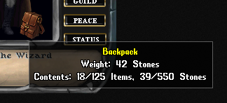

The lower right of the paperdoll has a backpack. This contains the items you are carrying.

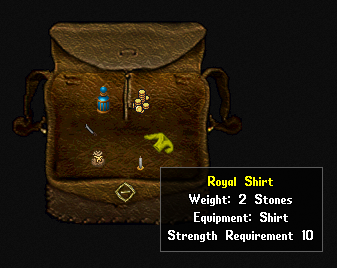

If you hover the cursor over a container, you can usually see how much weight it is holding, along with the number of items in it. Double click the backpack to open it. Here I have some gold, water, candle, bag, knife, and shirt. When I hover my curser over the shirt, I can see that it has an equipment slot set for "shirt".

### Equipment

Items with equipment notes can be dragged and dropped onto your paperdoll to equip the item. Each equipment slot category can only have one item at a time. This means that you cannot have two shirts on at the same time. To remove items from your paperdoll, you can drag and drop them off the paperdoll. You can set items in containers, or on the ground.

Like the items in containers, or on the ground, you can also hover your cursor on equipped items. This will show some things about the item. Some items can be single clicked to open context menus. One may be "Examine" to select which will show more information.

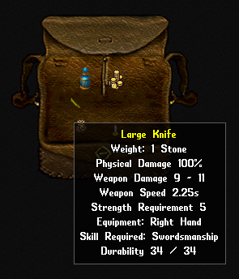

Items such as clothing, armor, and weapons usually have the most information to show. Here is an example of the large knife in the backpack. You can see the damage it does, the general speed of the weapon, and the strength required to wield it.

### Maximum Capacity
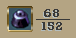

Your strength determines how much you can carry. You can see your carrying capacity in the character information window. Your backpack also determines how much you can carry. Your backpack can carry up to 125 items and up to 550 stones. Whichever is reached first. If you are carrying more weight than your strength allows you to carry, then you will be unable to move unless you lighten your burden.

### Stackable items
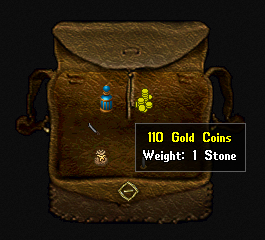 
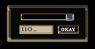

Some items are stackable. This means that they can be stacked onto each other as a single item with a quantity. The weight increases as you stack items in this fashion. Here you can see I have some gold coins in my backpack. When I hover over the stack, I can see that there are 110 coins. If I select such an item and try to drag the stack of items, I will get a window that will allow me to split the stack into smaller amounts. You can either type a value in the box or use the slider to set the amount. Press the OKAY button to split the stack and drag it elsewhere.

!!! danger "Be careful where you put your items!"

    If you drop items on the ground, they will be gone after a period of time elapses (decay). If you put items in a container that is not yours, it will likely be gone later as well. There are places to safely stow items that will be discussed later.

### Usable Items

Some items can be used. To use an item, double click it and see what happens. If an item cannot be used, nothing will happen. Here is a small list of items that can be used in this fashion:

|  |  |  |  |
| --- | --- | --- | --- |
| - | Food | - | Drink |
| - | Potions | - | Bandages |
| - | Tools | - | Books |
| - | Scrolls | - | Wands |
| - | Containers | - | Doors |

Some of these items are allowed to be used multiple times. Others have a single use or a set number of uses. Potions and scrolls, for example, have a single use. If you drink a potion from a stacked quantity of 35, the stack will reduce to a quantity of 34. Items such as wands and tools have a limited number of uses. Items with a set number of uses will usually indicate the amount when you hover over them.

Some things can be given to NPCs by just dragging and dropping items onto them. This is usually done when you must give them gold for something specific, or a specific item they are expecting.

## Paperdoll
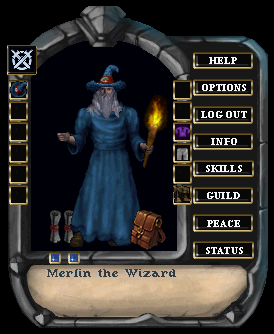

You can do more with the paperdoll other than dress yourself and look over your equipment. We will cover the functions you can perform here.

### Profile and Party Buttons
There are two blue buttons on the lower left. If you double click the first one, you will open a scroll that shows you how old your account is. You can also write in this scroll by selecting the blank line at the top. This is your player profile. The other opens a window for party management. Parties can be formed on multiplayer games, where you can invite others to be in the same party. This gives benefits such as messaging, group looting, and friendly effects of spells and such.

### Help Button
The HELP button will open a detailed window of options and information. Each section is described briefly below:

**AFK** – Sets your character as "away from keyboard". It only indicates to others in multiplayer that you are away.

**Chat** – This opens the chat window, where you can message other players.

**Conversations** – When you talk to NPCs (non-player characters), some of their conversations will be saved here for future reference.

**Corpse Clear** – You may have suffered multiple deaths, and your corpses litter the land. This will clear them away from boats and land.

**Corpse Search** – This can help you if you meet an untimely end and you go back to gather your belongings.

**Emote** – This launches a window that allows you to choose character actions such as sneezing or laughing.

**Library** – You will discover books and scrolls with important information. Reading them may store them here for future reference. You will begin the game with a few books in your library.

**Magic Toolbars** – These are handy icon bars for spell casters. They are customizable and make using magic easier.

**Moongate Search** – Moongates are mystical portals that you may find in the land. This will try to find the nearest one to you.

**MOTD** – This will display the message of the day from the server administrator.

**Quests** – You will get some quests that will be recorded here for reference. Some milestones will also be shown. Not all quests will be displayed here, however, as some may be with the item that started the quest, or in the QUEST gump.

**Quick Bar** – This is a handy icon bar that gives you quick and easy access to common functions. You can customize it.

**Reagent Bar** – Reagents are ingredients for potions and spells. This bar is customizable and allows you to track how many you have of each.

**Settings** – There are many custom settings for your character here. Each setting has an information window you can open to see what the setting does.

**Skill List** – This is an alternate listing of skills you can use to monitor your character's progression.

**Statistics** – This is general server statistics.

**Stuck in World** – Sometimes you may have an issue where you are physically stuck and cannot move. You could fall between a mountain, tree and rock. Or you are on an island. This can free you from such a fate.

**Version** – This is a log of updates that were applied to the game.

**Wealth Bar** – This information bar will do its best to show you your current wealth from both your bag and bank box.

**Weapon Abilities** – When your character gets skilled with weapons, they have access to special abilities with such weapons. This option will open that icon bar to activate these maneuvers.

### Client Configuration Button
The OPTIONS button will open settings for the behavior of the game client.

### Information Gump Button
The INFO button (or [status) will open an information window about your character, which has much more detail. You get an in-depth overview of the many statistics that make your character what they are.

These statistics are normally generated by items you find and racial innate bonuses. Magic items that can perhaps increase your damage, or regenerate your hit points, will show those values here.

The lower left has a button you can press to see if you are a wanted criminal. If you are innocent, then you can breathe easy. Otherwise, you can open the wanted poster to see the crimes you may be in trouble for and cities that allow shady individuals.

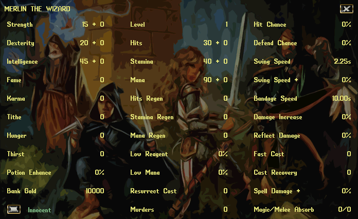

### Skills Button
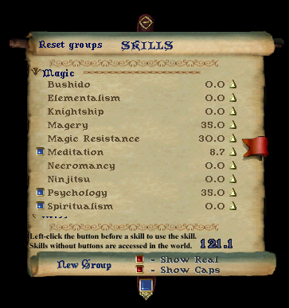

The SKILLS button will open a scroll showing all of the available skills in the game.

### Player Guild Button
The GUILD button either lets you start a guild or manage a guild you lead.

### Combat Mode Button
The PEACE/WAR button is a toggle where you are either non-combative, or ready for combat. The Tab key is a default toggle for this.

### Status Gump button
The STATUS button will open the character information window as discussed earlier.

## Statistics
You have three different statistics that have various impacts on your character:

**Strength** governs how much you can carry, how much damage you can do in combat, and which weapons and armor you can equip. This also has a direct correlation with your hit points. Hit points determine how much damage you can take before death. Your strength affects this value. There are various methods of healing that you must discover.

**Dexterity** determines how quickly you react and directly correlates to your stamina. Stamina determines how long you can keep moving or fighting before getting tired. Some potions, or simply resting, will replenish your stamina.

**Intelligence** affects many skills, especially in the categories of crafting and wizardry. This also has a direct correlation with your mana. Mana is your magical aptitude, and it is derived from your intelligence. It also is sometimes used by warriors to perform some feats of battle.

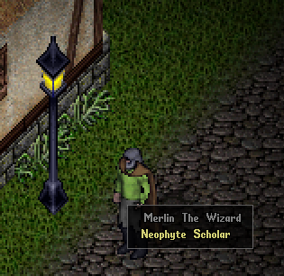
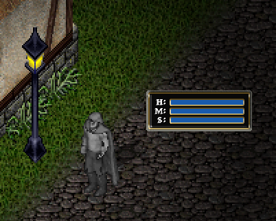

Your abilities can rise when they are directly used by your actions. To manage these ability levels, you can use your cursor and hover over your character. When you click on your character and drag off away from it, you will see a set of status bars that represent your hit points, mana, and stamina. These bars are commonly used during gameplay, as they let you quickly see how healthy your character is. If you double click these bars, it will change to a more informative window that you can see on the next page.

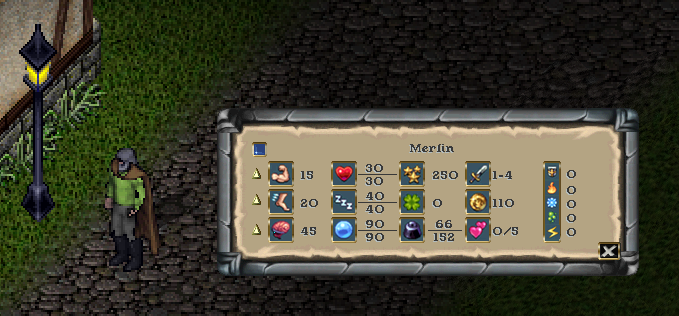

This information window displays your name at the top. There is a blue button on the upper left, that will open your status icons bar (explained later). You will see the values of your abilities and statistics that they affect. You can hover over each piece of information to see what it represents. You can go back to the status bars by selecting the "X" button at the bottom right. You can close the window entirely by right clicking on it.

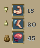

One important function with this window is the option to set your abilities to cease from increasing. You can gain a maximum of 250 ability points. Notice the up arrows next to each of the abilities. Clicking these arrows will turn the arrow up, down, or locked. Locking an ability will stop it from raising or lowering. Setting the down arrow will lower that attribute when you have already reached the limits of available points and another ability is trying to rise.

This allows you to better tune your character to ensure you get the ability values you desire for your character archetype goals. For example, you want a barbarian with high strength or a wizard with high intelligence.

## Status Icons

During play, various effects will be applied to your character: some positive, some negative. You can monitor these effects by using the status icon bar. Select the blue button in the upper left of your character information window to open this icon bar. Like most gumps, close this bar with a right click.

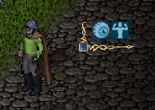

It will be empty of icons if there are no current effects. In this example, I have *night sight* and *strength* enhanced by potions. There is a blue button in the corner. Clicking this button will rotate the direction the icons stack.

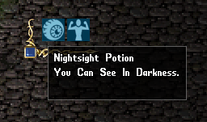
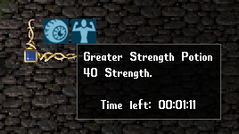

You can hover over the icons to see what the effect is, and perhaps how much longer the effect will last. When the effects are wearing off, they will start flashing.