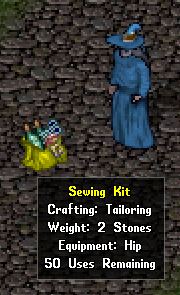
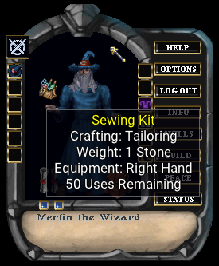
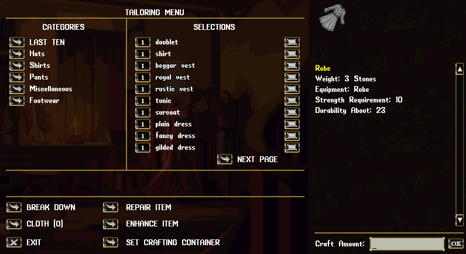
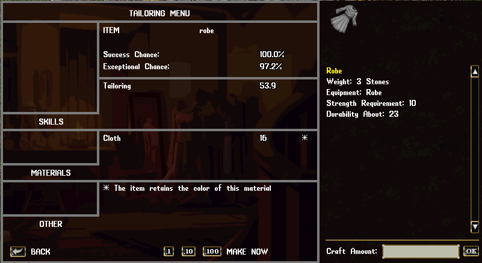
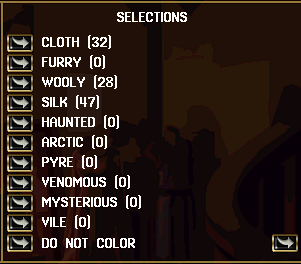
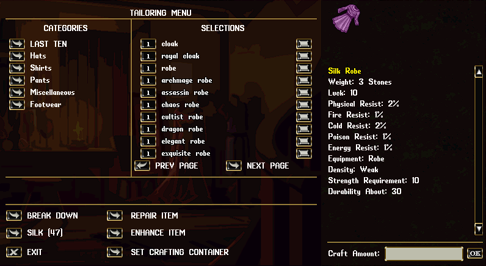

# Crafting

The ability to create something from nothing is the general mantra of the crafter. There are many schools of crafting, and you will have to discover them on your own. Crafting requires tools to perform, and they must be equipped to craft. In most cases, one good in tinkering can create these tools. If you want to purchase tools, try seeking the merchant that perhaps deal in that trade.

Most tools are equipped in the right hand. These items are seen on your paperdoll, near that hand. There are some that are held in the hand, like blacksmith hammers. Each tools shows what type of crafting it is for, along with the amount of times you can use it before it is worn out.

To begin crafting, use the equipped tool. A window gump will appear, showing you a list of items you can possibly craft. There are categories on the left. If you select a category, then the items will appear in the middle. Any item you select in this process (the scroll button) will show its appearance and the information about it on the upper right.

There are some options on the upper center, and they can vary due to the type of crafting. You can *break down* an item into basic resources. Items with durability can be *repaired*. The choices of materials can be selected, or you can enhance an item.

*The breakdown of items is covered in the Harvesting section.*

*Enhancing* items is when you have an existing item, but you want it to have it constructed into a different type of material. Here is an example scenario:

You have a furry robe that you want to make into a pyre robe. Set the resource type as pyre cloth, and then press the ENHANCE button and select the robe. If you are successful, the robe will be made of pyre cloth. Note that a failure can destroy the item.

When you select an item to view, you will have a new window open. This looks similar, but has specific information on the item. You can see the chances you have to make the item, based on your crafting skill. Along with that, you will see the minimum skill required and the type of skill needed. The amount of resources needed will be displayed as well.

Some items will have multiple resource requirements, and you will need all of them to craft the item. Although most items only require the actual crafting skill to make, there are some items that will require proficiency in additional skills. If the primary resource has an asterisk, it is indicating that the crafted item will be the same color as the resource being used.

When you are new and just starting out, you are likely only able to craft items from the basic materials. In the example, you can see that I have 32 regular cloth in my backpack. If you select the button to the left, you will see another menu list appear in the lower center. This list can be used to select a different resource type to craft with. You will see the quantities of those types of materials that are in your inventory, if you have any.

If you select another type of material, your resource will change. If you are not good enough in the crafting skill, you will be notified that you cannot work with the material. As you select different resources to craft with, the last item you viewed will show you the new color and description of the item. Other resources can give benefits to the crafted item, in comparison to using regular resources. Crafting with new resources also grants additional chances for skill gain!

To craft an item, you can press the number button next to MAKE, or the number button next to the item name. For multiple crafting at once, you will see buttons for 1, 10, or 100 items at a time. Or you can set a value up to 100 in the "Craft Amount:" box.

As you craft items, your skill will increase in that trade. The better your skill, the more items you can make. Your skill will also determine the resources you can use and the success chance at creating items, especially of exceptional quality.

!!! tip ""
	You can set a container where crafted items go by default. This is in the paperdoll's HELP section under SETTINGS
