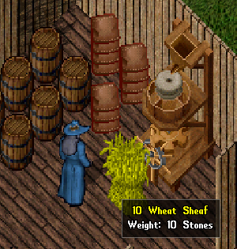
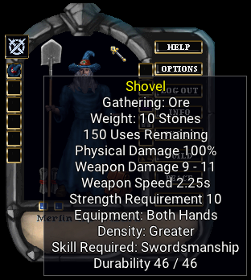
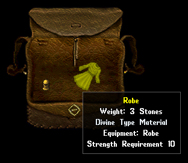
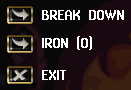
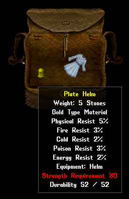

# Harvesting

Some resources can be harvested from the land. You can raid a farmer's field and take all of their cabbage. The weaver may be growing flax and cotton that you decide to take. You can shear the sheep with a dagger, and gather their wool. An empty decanter can be used on a cow to get some milk. Some resources can be used on items to create other resources. Taking wheat from a garden, and using it on a flour mill, can produce sacks of flour for cooking. Using cotton on a spinning wheel will produce string that you can use on a loom to make cloth.

Many creatures you slay can also provide valuable resources. If you kill a chicken, you can use a bladed item on it to cut off the meat and feathers. Slaying a giant serpent can then be cut away to gather the leather. Don't discount any creature you slay. If you want to fully explore the world, try to cut up what you kill. You may be surprised what you find.

Resources are used in various ways, and often for crafting other items. The methods already mentioned do not generally require proficiency. They are just mundane tasks anyone can perform to achieve the resulting items. There are some forms of harvesting, however, that will require some level of skill to do.

Characters can do various harvesting tasks like mine for ore, fish, chop trees for wood, rob graves, create wax, or even search old shelves in dungeons. Tools for harvesting must be equipped to be used. If you hover your cursor over the item, it will display what it harvests for. The tools have a limited amount of uses, as they wear out over time. When equipped, you use the item and target the appropriate place to use it. Shovels are used on cave floors or mountain sides. Fishing poles are used on water.

These particular forms of harvesting require skills to perform. Sometimes they only enhance success, while others have an additional benefit of finding a better resource. As an example: you can be really good at mining and find better types of ore than regular iron ore. Success in finding these better resources, however, may not be sought by the character. You may want to acquire huge amounts of iron ore instead. Toggle the setting "Ordinary Resources" and your character will only gather regular resources like iron ore, plain leather, or ordinary wood.

Items you find may be deconstructed to the basic material that makes the item. If you find some clothing, you can perhaps use scissors on it to turn it back into regular cloth. That cloth can be used to make something new. There are also many crafting tools that will allow you to breakdown an item in the same manner.

!!! tip "You can set a container where harvested resources go by default. This is in the paperdoll's HELP section under SETTINGS. This is where you can toggle ordinary resources as well."

There are times where you will find items that are made of a "type" of material, but it doesn't have the properties of that material. Here is an example of a robe, that is made of a divine cloth "type" material but it doesn't have the attributes that a fully divine robe would have. If you break this item down, you will get some divine cloth that you could use to make something with. Perhaps a fully divine robe.

When you breakdown an item, you generally get the amount of resources that equate to the weight of the item being broken down. So a metal item made of gold, that weighs 5 stones, will give you 5 gold ingots. If you have a regular item, that is made of some "type" of material, you will get that type of material the same way. The exception is clothing. If clothing is made of some "type" of material, and you cut it up or break it down, you will get much more cloth back than the weight of the item.

Here is an example of a plate helm. It is made primarily of iron and has attributes commensurate with iron, but it does have some gold type material in it. It generally has the color of gold. If you were to break this item down, you will get 5 gold ingots.

When items are made of extraordinary materials, it requires a particular skill in the crafting category to break it down. So you would need a good skill in carpentry to break down an elven wood shield.

You may be able to sell the resources you gather, but some find the most profit by creating something from them. Whenever you find a new resource, see if you are able to examine it. It may help you figure out what you can do with it.
