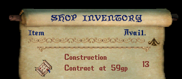
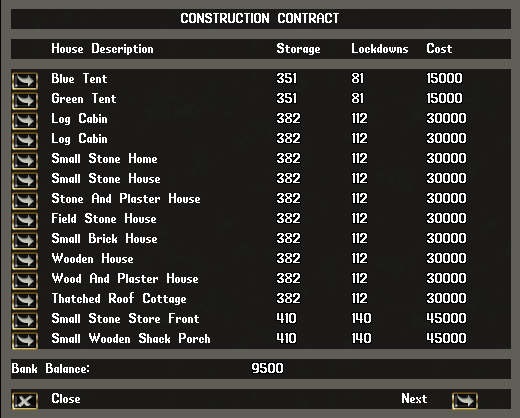
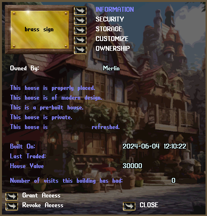
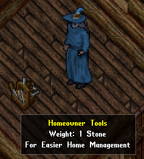
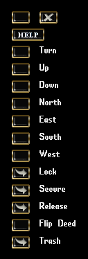

# Home Ownership

When you have a bank full of gold, and a desire to own land, you can build a home. Homes can be built with construction contracts. They can be purchased from an architect.

House construction costs will come out of your bank box, so make sure you have the appropriate amount of gold coins in the bank. Then find yourself a nice flat piece of land, void of any obstructions. Use the contract and begin browsing the home options.

Each house has a storage limit and lockdown limit. Lockdowns are items like containers or decorations. Paintings, statues, or furniture are examples of items you would lock down. The containers you have locked down can hold the storage limit. The larger the home, the more expensive, and the more you can put in it.

You can select a home from the menu, where you will get a targeting cursor that has a preview of the home. This not only allows you to place the home, but also get a good look at the exterior to see if it interests you.

When you finally place the home, a sign will be placed on the outside of it. This sign not only tells others who the house belongs to, but using the sign will allow you to manage it. You look over general information. You can manage the security of who can enter your home and who cannot. You can assign co-owners so they have certain privileges in the home. You can also demolish the home.

If you choose to perhaps move to a new home, and your home is full of items you amassed, you may want to explore using a housing crate. They are sold by architects, and they are different from other containers. You bring them to your home, and you can place as much as you want into it. Once you empty your home into the crate, you will be able to carry it to your new home. You can only access the crate from within a home you own, or if it is in your bank box.

Vendors can be hired to live at your home. A contract of employment will give you a vendor that you can sell your ware from. You can get a contract of employment, which will allow another player to place a vendor in your home. You can also hire a barkeeper to serve drinks. Many of these features are mainly used in multiplayer games. For single player games, you may want to consider a merchant crate. These crates are placed in your home where you can place the items you craft in it. Every day, someone from the merchant guild will stop by and empty your crate and leave the total value of gold for you to collect.

There are homeowner tools that you can purchase, that will help you manage the layout and decoration of your home. It is highly suggested to get these tools and leave them in your home when you are not using them. When you use them, a menu will appear that you can use to secure items and move them around.

Some items can be in the form of deeds, or noted that you would use them to place them in your home. When you use these items, and target a spot in your house, then the actual item will appear. These can be moved around with the homeowner tools. If you want to remove such items from your home, you can simply use an axe on it to chop it down back into its original deeded form.

The top right button will close the tools, where the button to the left of that is something you can select with your cursor to move the bar around the screen. You can turn some items to face another direction. You can move locked down items in six different directions. There are buttons to lock, secure, and release items. You can flip a deed (see HELP section), and place a trash barrel.

Make sure your items are locked down, and your loose items are properly stored in locked down containers. If you do not, then they will be gone after a period (decay) and lost forever. Unless your game settings were changed, houses do not crumble and fall after a set period. They will be there until you choose to demolish it.

Here are some phrases you can speak in your home that provide some functionality:

*"Remove thyself"*

This will remove the target from your home.

*"I ban thee"*

Remove the target and they cannot enter again.

*"I wish to lock this down"*

This will lock down an item.

*"I wish to secure this"*

This will lock down an item, but also allow you to set security on it.

*"I wish to release this" or "I wish to unsecure this"*

Target an item to release from a lock/secure status.

*"I wish to place a strongbox"*

Allows friends or co-owners to place a secure box for themselves to use.

*"Trash barrel"*

Place a barrel in your home, that will remove trash you place in it.

