## Equipment

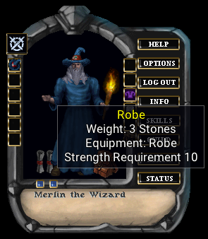

There are some items that can be equipped on your character. Most of these are in the form of armor, weapons, clothes, or jewelry. Items that can be equipped will display an "Equipment" attribute when you hover your cursor over them. There are many equipment slots available to a character:

|  |  |  |  |
| --- | --- | --- | --- |
| - | Right Hand | - | Left Hand |
| - | Boots | - | Legs |
| - | Chest | - | Helm |
| - | Shirt | - | Skirt |
| - | Gloves | - | Waist |
| - | Ring | - | Neck |
| - | Wrist | - | Ears |
| - | Arms | - | Trinket |

If you have an item that is used by both hands, then it will display an equipment slot of "Both Hands". This means that you cannot place anything in either the left or right hand. Items for both hands could be staves, polearms, shovels, and fishing poles.

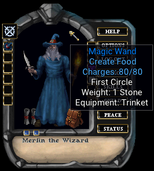

Equipment can have magical properties applied to them. Some may be able to unleash a magical enchantment. These can be recognized by hovering over the item. If you see a magical spell name, and an amount of charges, then that item would have that spell imbued in it. Some of these items can be used to cast the spell. Other items may require you to single click and select the "Magic" context menu. If you choose the "Examine" context menu, you should get a description of the spell it can cast.

!!! tip ""
    [Item Properties](appendix-item-properties.md) has a list of all magical attributes

Not all equipment items will have all of the listed item properties available to them. For example, a magical harp will not have a spell channeling property like a weapon would. This is because spell channeling has to do with weapons staying wielded during spell casting.
## Followers

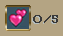

Followers come in many forms. They can be henchman you hire at the tavern. It can be a pet you buy from a stable, or a creature you tame into submission. Each character has a limited amount of follower slots to take followers along. Some may utilize a single slot, while others may require 2, 3, or even 4 slots.

As already stated, some henchmen can be hired at the tavern. You may even save one from a dungeon. There are items that may help you acquire a follower. A common approach is using the taming skill.

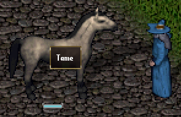
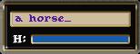

To see if a creature can be tamed, single click them. If you see the **Tame** option, then you can attempt it. If you succeed, then you have a new pet. These types of pets can be renamed. To do so, drag their health bar off of them. Use your cursor to select their name, and you will see that you can clear the name and type a new one of your choice.

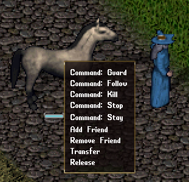

There are commands you can give to followers, and you can see them when you single click the follower. Not all followers will have the same options. Below is a brief description of commands that you can give followers:

|  |  |
| --- | --- |
| Guard | They will guard you if someone tries to cause you harm. |
|  |  |
| Follow | They will go where you go. |
|  |  |
| Kill | They will try to kill your target. |
|  |  |
| Stop | They will stop what they are doing. |
|  |  |
| Stay | They will stay in the spot you tell them. |
|  |  |
| Transfer | Give your follower to someone else. |
|  |  |
| Release | You can release your follower. |

There are sometimes options to add or remove friends, where adding them may provide some benefits to your party members.

Some followers require food to remain loyal. Others may require treasure. A follower that has no loyalty is usually not a follower for long. If you have a good druidism skill, you can use it on a pet. This will show you their information.

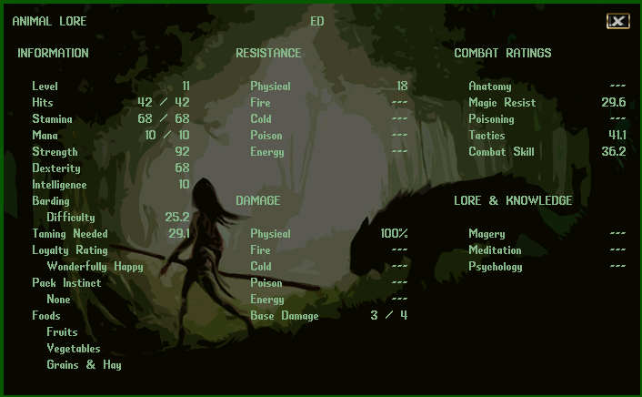

Some followers have skills that will progress as they fight in battle with you. These followers are generally the ones you have tamed. You can check this information screen periodically to see their progress.

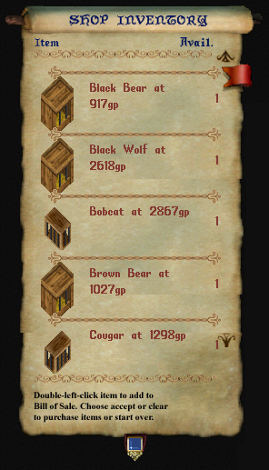

If any merchants are selling creatures, you will see it in their inventory. Buying these require no skills in druidism or taming, but they cannot be bonded unless you possess those skills.

When you purchase one, you will be given them in a cage. Use the cage somewhere and the creature will appear. They will immediately become your follower.

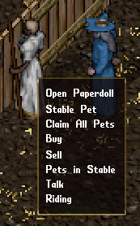

Almost all creature followers can be brought to the stables if you want them to have a safe place to stay. The stable master will charge you a weekly gold fee to do so. You can claim your pets or see which pets are in the stable currently. If you ask them about riding, they will show you the type of creatures that can be ridden.

If your taming is high enough, you may want a tamed creature bonded to you. Bonded creatures are able to be resurrected, if they meet an untimely end. To bond a pet, simply feed them immediately after taming, and then again after 7 days of real time. If you succeed, you will get a message that they are bonded to you.

There are also unique creatures that have a set of rules that do not apply to them like regular creatures. Some of these cannot be stabled, for example. Any such followers will have these details explained to you when you discover them.

## Skills

Whether you want to be a powerful wizard, or a savage barbarian, skills are what define you as a character. To learn about the available skills and what they do, see Appendix A. Here we will discuss how to use and manage your skills.

To access your skills, use the SKILLS button on your paperdoll. The list is separated into a few categories, and you can expand them by selecting the arrows to the left of the category name. Generally, your character will be able to use up to 1,000 real/raw skill points before you cannot gain anymore. Note that certain crafting and gathering skills are not included in this skill cap.

To the right of each skill value is an arrow that you can select. Like your abilities, you can set a skill to raise, lower, or lock. If you want a skill to lower, it will only lower once you have acquired the maximum skill points you can, and another skill raises to cause the other to lower. If you lock a skill, it can no longer raise or lower. So, if you want just enough bowcrafting to just make arrows, you may lock it at 25 or 30 skill points.

Although there are default category-groups for skills, you can make your own if you select NEW GROUP. This will allow you to make a custom group of skills you want to focus on. Once a group is created, you can drag and drop skills onto this group, and they will move into that category. You can also select a group and press the DELETE key on your keyboard to remove it. If you do this, any skills in that category will be moved to the MISCELLANEOUS section. Selecting RESET GROUPS will put everything back to default.

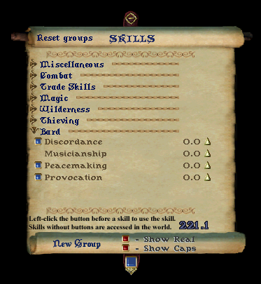

If a skill has a blue button to the left, this means that you can activate it directly. Other skills are triggered during various game events and do not need to be triggered. In the example here, we can see that provocation is such a skill. If you are a bard, you can use this button to play a provocation song on a targeted enemy. You can also click and drag such skills onto your game screen. This will make a button that you can quickly use to access the skill. Or you can set a hotkey macro in the OPTIONS.

There are a few buttons on the bottom. The blue button, on the middle ribbon, allows you to click and drag it up or down to see more of the scroll. If you select SHOW REAL, this will show you the raw skill scores you have. Otherwise, the value you see will be your skill value, and any values that items or race may provide bonuses for. The SHOW CAPS will show you the maximum number of skill points you can gain for each skill. This is normally 100, but can be increased up to 125 with power scrolls.

The more you use skills, the more they will increase. These skill increases can also help you gain ability points in strength, dexterity, or intelligence.

### Learn from NPCs
There are some other methods to train skills. You can use a weapon on a training dummy. With a bow you can shoot at an archery butte. Thieves even have practice lock boxes or pickpocket dips. Many will seek out the local merchants and townsfolk to see if they can teach you anything.

When you single click on an NPC, you can see if they are able to train you in anything you seek knowledge in. If it isn't listed, they cannot teach it. If you see that they teach a skill, but it is not selectable, it is only because you have surpassed them in that skill and thus cannot learn anything new from them.

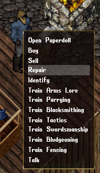

If they can train you in something, then select it from the context menu. The NPC will tell you how much gold it would cost to teach you up to their highest level of knowledge in the skill. You would then need to drag and drop gold onto them to acquire the training. If you drop less gold than they stated, they will teach you less. NPCs have a pretty minimal level of skill they can teach you. It can get you started quicker in those skills, but you will have a ways to go before you become a grandmaster in that skill.

## Combat

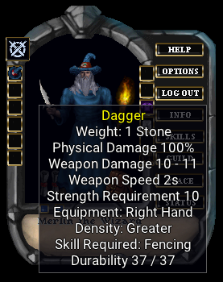
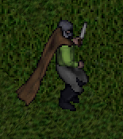

Getting into battle is what any good barbarian would do. Demons and dragons will surely have issues with you trying to take their piles of treasure. Maybe you want to teach a lich lord a lesson. Whatever the reason, you may benefit from fighting.

Here we have Merlin, equipped with his dagger. We can see that it uses fencing. It is to be equipped in your right hand and the damage it causes is 100% physical. This means it doesn't do any percentage of cold, fire, energy, or poison damage. Just physical. Different opponents have strengths and weaknesses toward the types of damages weapons cause. The dagger has a swing speed of 2 seconds and can cause between 10 and 11 points of damage. One needs a strength of 10 to even wield the weapon. If I press the PEACE button on my paperdoll, or push down the TAB key, he will be in war mode and ready to fight. Double click an opponent and get ready to fight.

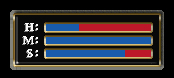

You can have your status bars open so you can watch your overall health. You can also click and drag from your opponent their health bar. When you have status bars open, yours or theirs, they can be targeted and double clicked instead of the actual creature you see. This makes selecting others easier when you have a crowd. Here are some examples:

*Double click a bandage and select your status bar to begin the attempted healing.*

*Use an explosion potion and target an ogre's health bar to throw it at them.*

*Quickly switch who you are attacking by double clicking their health bar.*

The tactics of combat are up to you. When to heal, how to heal, when to evade, when to run. These methods are up to you to learn. If you want to practice a fighting skill that you are beginning, seek out a training dummy or archery butte. Try not to go into town while in war mode. You don't want to accidentally attack and slay the blacksmith.

## Magic

### Standard Magic
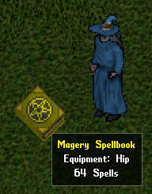

Magic is a general category of mystical effects caused by spells or special abilities. These are managed and used from books or parchments. The most common form of magic is magery. Magery has up to 64 different spells, separated into 8 circles. Each circle has 8 spells. The higher the circle, the more magery skill is required. Magery spells must be acquired from scrolls, and they can be placed onto the book to add the spell. Scrolls can be purchased, found in treasure, or created by scribes. You can cast magery spells directly from scrolls, but the scroll will vanish once cast.

You can open a book by using it. At the top right or left corners, there will be page bends that will help you turn the pages. Spells require reagents, which can be found or purchased. On the next page, you can see that the Clumsy spell is a first circle spell that requires bloodmoss and nightshade. Spells also require mana to cast. So, if you run out of mana, you must wait for it to replenish before you can cast more spells. The icons on the pages can be dragged off the page to make a quick icon.

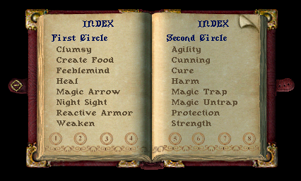

You can select a circle icon at the bottom to navigate.

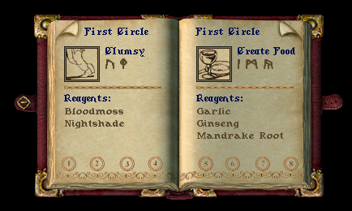

### Alternate Magics
There are only a few forms of magic that have drag and drop icons available. They are magery, necromancy, knightship, bushido, and ninjitsu. Other forms of magic do not, but there are other ways to quickly use these spells and abilities. Here is an example of a book that does not have drag and drop icons. We can select the buttons to the left of the spell name. We can go to the page that describes the spell and cast it from there.

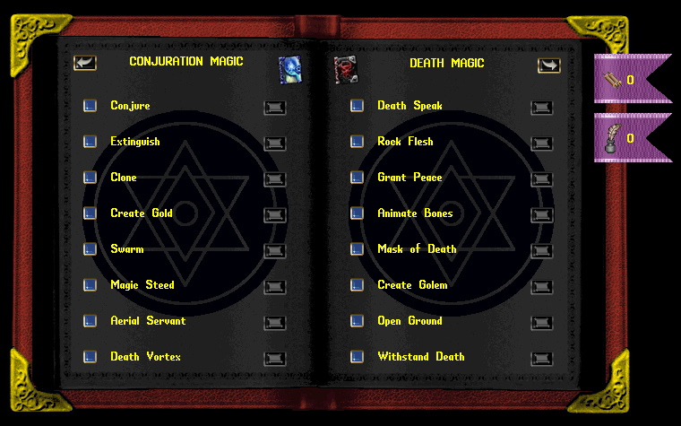

There are also toolbars you can configure in the HELP section of the paperdoll. You may also use the "[toolbars" command as a shortcut.

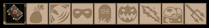

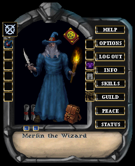

Many of the books can be equipped in the trinket slot. This will be displayed in the upper right of your paperdoll. Many of the adventurers will equip spellbooks that have magical properties on them, where equipping it will give the added benefits.

You will have to decide to pursue these spells or abilities on your own. They all have their own features, as well as their own skill requirements and resources. Elementalism, as an example, does not use reagents like magery or necromancy spells do. Instead, it uses the caster's stamina. Shinobi abilities are not acquired by scrolls, but instead you must find a special item in a dangerous location to be worthy of the ability.

Some forms of magic can be learned by citizens in town, where others cannot be learned until you discover their existence. Pursuing these mystical abilities is a quest within itself. You may have to travel far and wide, or deep in tombs and dungeons to discover the secrets. Any form of magic you find will likely have pages explaining how that magic works.

## Items

Items are any object that you can interact with. Either taking it, using it, or having it react to your actions. There are many items in the game, and this book will not be covering them. You will have to find them and learn what they do and how to use them.

Items can be purchased or found, and many of them are common enough to deduce what they do. Some items can be single clicked and have an "Examine" context menu – this may provide information on what the item does. An NPC may tell you what items do as well. Some are very simplistic, and merely hovering your cursor over them will reveal their purpose.

Some items can be stacked on top of each other, to create a single item that can be used and managed. An example would be something like empty bottles. If you place an empty bottle on top of another empty bottle, you will have a single item that displays an empty bottle with a quantity of 2. When you drag these items around, you will be presented with a window to separate the stack into smaller amounts.

Items generally have weight, which is measured in stones. Your character's strength determines how much weight you can carry, and containers have their own maximum weight they can hold as well.

!!! tip "Object Handles"
Holding `CTRL + SHIFT` will show nameplates of items and mobiles for easier access.

### Moving Items
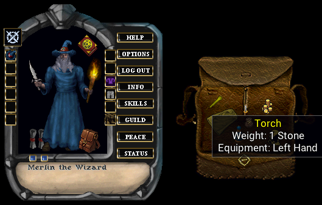

You can carry items on your cursor. This is done by clicking on an item and dragging it with the mouse button pressed. Releasing the button will attempt to drop the item. If you pick up an item that is too heavy, then you may not be able to walk with it. However, you can set it at a new location nearby.

Items have the potential to be dragged and dropped between characters, containers, and onto the world. They may allow one to place them on the ground or on top of other items.

### Unidentified Items
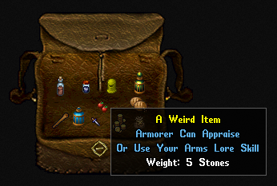

You may also come across items that are not quite identifiable. These items tend to provide some text that will describe what skill you would use to identify it, or perhaps a merchant you should seek out and they can identify it for you. There are 3 skills that are used for item identification.

|  |  |
| --- | --- |
| Arms Lore | This can be used to identify weapons or armor. |
|  |  |
| Mercantile | The most commonly used skill to identify items. You can also perhaps estimate a gold value you could sell something for. |
|  |  |
| Tasting | This can be used to taste items such as liquids or possible reagents. |

Such skills can be used directly on the item. If your skill is good enough, you may be able to appraise it. In general, unidentified items are useless where they cannot be used as intended. Weapons or armor cannot be equipped when unidentified. You can't drink a potion if you don't know exactly what it is.

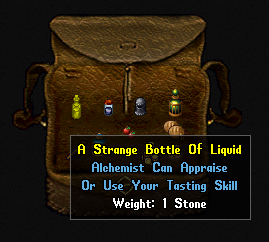
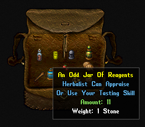

There are particular items you can find, that are decorative in nature. Meaning, they have little purpose other than to decorate a home, or to sell for a hefty price to a vendor. These are recognizable as being unidentified, just like other items previously discussed. If you try to sell such items, without identifying them first, the merchant will surely get a good deal.

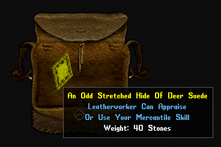