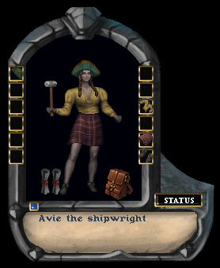
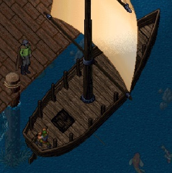
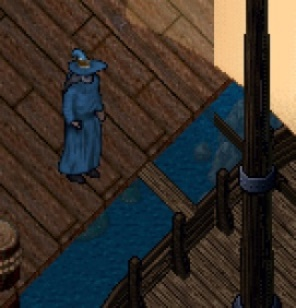
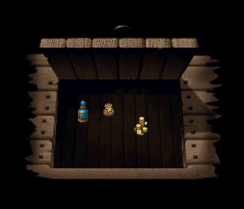
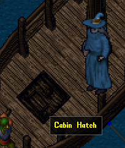
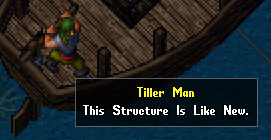
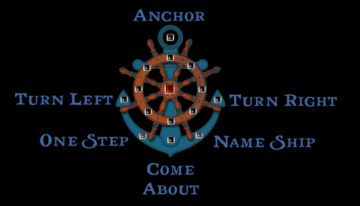

# Ships

### Purchasing a Boat

When you acquire enough gold, you can purchase a boat to sail the high seas. Ships can be purchased from settlements where shipwrights have set up shops. They vary in size from small, medium, and large. The larger the boat, the more items the cargo hold can contain. The purchased ship will be a small boat model in your backpack. Take it near the sea and use it from a dock. Like a home, you will get a targeting cursor for you to place your boat on the water. Once placed, a key will be placed in your backpack and bank box. These keys are required to lock and unlock your ship's door. So, if you are playing a multiplayer game, you would want to lock your ship, so nobody steals it. The keys are also something that can have gate/recall magic cast upon it, to teleport to the boat's location.

### Boarding a Boat

To lock and unlock your boat, you would use the key and then select the door of the boat. The door is located on the left or right side, and more toward the center. If you hover your cursor over the railings, you will find the door. Use the door to open it and a plank will appear. If you are not on the ship, and you use the plank, you will move onto it. If you are on the ship, it will close the plank.

### Using your Hatch

The front of the ship has a hatch which is the hold of your ship. If you use the hatch it will open where you can drag and drop items within it.

### The Inner Cabin

If you have a good seafaring skill, and you launch a ship on the sea, you may have a hatch appear on deck. This hatch will lead to the deck below. There you can enjoy a drink, seek services from the healer, and even buy some provisions.

### The Tiller man

The ship will have a tiller man. If you double click him, a navigation window will appear. You can use the buttons on the dial to move in that direction. The other buttons are labeled below for reference. If you want to dry dock a ship (turn it back into a boat model you can carry), then make sure the deck is clear and the hold is empty. Also ensure that the anchor is down. Leave the boat and then double click the tiller man. They will ask you if you want to dock the ship.

!!! tip
	To learn about all the aspects of sailing the high seas, look for a book called `Skulls and Shackles`. It will explain things in much better detail.