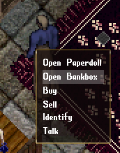
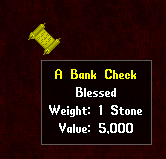
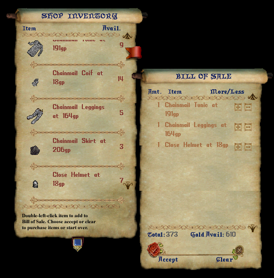
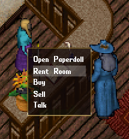
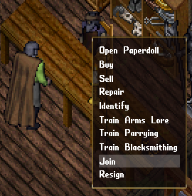
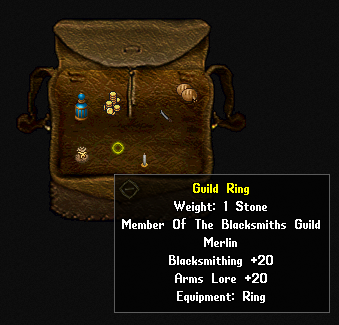
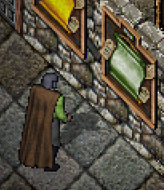
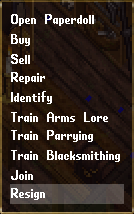
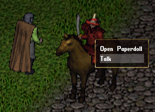

## Commerce

### Player Bank

Gold coins are the primary currency in the land. There are other forms of currency that need to be exchanged for gold coins as vendors will only buy and sell with gold coins. Wealth can be acquired through selling goods or adventuring.

When you begin to amass wealth, you may want to find a safe place to store it. You can find the nearest bank in whatever settlement you are visiting. To access your personal bank vault, you can use one of the safes. You can also approach a banker and say the word "bank" or select the OPEN BANKBOX context menu from them. Your bank box can store any assortment of items, and not just currency. If you want to stow something away to keep safe, use your bank box.

Bankers respond to some words you can say. If you say "balance", they will respond with how many gold coins you have in the bank. If you say, "withdraw 500", you will take 500 gold from your bank box. There also may be times you need to move a large amount of gold. You can do this by saying "check 5000". This will take 5,000 of your gold and turn it into a paper check. The check will be placed into your bank box. You can take this check and trade it to another player for goods or services. Using the check, while it is in your bank box, will deposit the gold value of the check. If you find other coin currencies like copper or silver, you can give it to a banker to exchange it for gold. You can also place the coins into your bank box and use it there to convert it to gold coins for you.

No matter what city you may be in, any bank you visit will give you access to the same bank box with all your belongings. They have limited storage, like your backpack or other containers.

### Vendor Goods
You can buy and sell wares with vendors you come across. You simply select the BUY or SELL context menu options to do so. Select the items you wish to buy and they will get totaled. Once you are happy with your purchase, you can press the red wax seal on the scroll. The same applies to selling wares. If you have items that the vendor is interested in, then you can sell such items to them in the same fashion.

Prices for items can be affected by skills such as begging or mercantile. They could also be affected by being a member of the same guild that the vendor is also a member of. Vendors usually only deal with items that are related to their trade, and they may not sell everything possible all the time. Check back later for new stock.

*The blue button, on the bottom middle ribbon, allows you to click and drag it up or down to see more of the scroll.*

## Inns

### Room Rental

You can rent a room at the inn, granting you access to additional storage of up to 500 individual items. The base cost is 10 gold per week, where the number of items stored will increase the value on subsequent weeks. So, if you renew your rental for another week, and your inn storage has 53 items, then the rental fee for another week will be 63 gold. If you talk to an innkeeper, they will tell you the upcoming cost of a rental. If you can pay the fee, or are within your week rental period, you will have access to your inn storage. You can choose their RENT ROOM context menu, you can say the word "rent", or you can use one of the inn chests from one of the inn rooms. You can give the innkeeper gold and they will put it in your inn storage. When you rent a room, the fee will be withdrawn from your bank or inn storage. Any gold used in bank transactions can be taken from either the bank or inn storage. This applies to resurrection tributes as well. When displaying your wealth, it will show the total gold coins in both the bank and inn. Items stored at the inn never go away. Items will be waiting, even if you are not paying for a current rental.

## Guilds

It has been previously described that you can start your own guild. Those guilds are a group of real players that decided to become a team and work together. There are also in-game guilds that focus on professions, and they are controlled by various NPCs in the towns and villages. If you find a guildmaster that interests you, you can see if they will allow you to join. They will tell you the amount of gold you need to give them to join. Once you hand them the gold, they will welcome you and give you a guild ring. The ring is commensurate for the guild you are in, providing skill bonuses for skills that the guild focuses on. You are the only one that can wear this ring. If you lose it, you need only give the guildmaster 400 gold and they will replace it for you. Membership means that you will get access to more available items to buy from vendors in the guild. You will also gain some skills faster. Look at your ring to see the skills that you will gain quicker.

You can learn more details about these guilds from the bulletin boards in inns, taverns, and banks.

You can only be a member of one such local guild at a time. To join another guild, you must resign from the first. You can approach your guildmaster and select the RESIGN option. You can also resign from the bulletin board. Keep in mind that joining the next guild will cost twice as much as the last.

## Non-Player Characters

There is a text entry bar at the bottom of the client window. You can select this with your cursor and type what you want to say, and press ENTER. This is usually used to talk to another player. You can also talk to many NPCs. Single click them and a context menu may appear. If there is a TALK option, select that and you can see what they may have to say.

Other NPCs have various other options that you can talk to them about. Some you can buy and sell from. They may repair an item for you or identify a strange piece of treasure. They can also perhaps train you. You will have to learn your way around and get to know people in the land. Make sure you TALK to each one, as they will provide more insight into how the world works.
