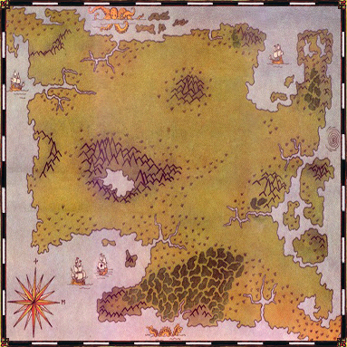

# Welcome

Welcome to a world of swords and sorcery, where you will make your own path through lands of fantasy and magic. After reading this guide, you can play the game and create your first character. Always keep in mind that you can always change yourself at any time. You can decide to become proficient in other skills. You may be a fighter but decide to become a wizard. In such cases, you can just stop learning the blade and instead seek knowledge of magery. It is never too late for you to make a change.

For those beginning their journey for the first time, you will find yourself awoken by the sounds of the forest. Nearby will be a gypsy tent along a peaceful stream. Browse the Potion Shelf and speak to the gypsy within. Learn your fortune from the tarot cards. Begin your new life.

Once your fortune is told, you will be in the land of Sosaria. Ruled by Lord British, Sosaria has just been saved from the clutches of Exodus by the Stranger. Although in this alternate reality, Exodus fled and has yet to be seen again. The remnants of Exodus' minions may still roam the land. The dungeons that were once cleared have had new denizens occupy the dark spaces deep below the land.

Knowledge gained from this book may enlighten you enough to cause alarm, making you wish to start your character anew. If you are new to the game, you may find yourself trying character archetypes, finding disappointment in certain styles, and decide to make new characters. This is normal beginner play as you find your personal style in this game.

This book will not contain secrets. It will not have every detail of the various aspects of the world. You will, however, have a basic understanding of how to function. Finding dungeons is up to you. Learning the strengths and weaknesses of enemies is up to you. Where you might find an item for sale is all up to you. All your questions, beyond this book, are simply quests you must undertake.

From this point onward, you will be able to learn about this world and how to live in it. You will be presented with a Table of Contents, which will allow you to navigate to the sections you wish to learn about.
