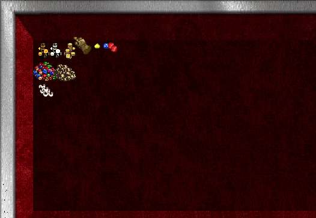

## Bank Half Usable
??? "Example"
	

!!! tip "Using a newer TazUO"
	Taz added support for loading `containers.txt` from the *Data Files* folder. This location is preferred.

- If your bank looks like correct but behaves like a smaller container, you need to update your `containers.txt`

- Place these entries at the bottom of your `C:\Ultima-Memento\Client\TazUO-Launcher\TazUO\Data\Client\containers.txt` file and restart the client
```
2617 45 44 25 25 575 344 0 0 0
2874 555 555 24 24 577 347 0 0 0
2875 45 44 24 24 577 347 0 0 0
2876 45 44 24 24 577 347 0 0 0
2877 72 88 41 61 187 157 0 0 0
```